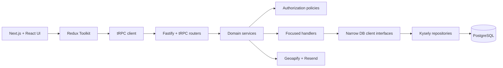

# Events System

A full-stack community event discovery and management platform built with
Next.js, Fastify, tRPC, and PostgreSQL.

Events System gives communities a shared place to publish events, manage
membership, collect RSVPs, and keep members informed. The application supports
public discovery alongside authenticated, member-only, and organizer-only
workflows.

## Features

- Discover and search communities and upcoming events
- Filter events by category and popularity
- Create communities and manage group membership
- Schedule, reschedule, cancel, and archive events
- RSVP as going, interested, or not going
- View attendance counts, RSVP history, and upcoming commitments
- Receive notifications when organizers create or update events
- Browse group calendars, event history, and archived events
- Recover sessions and reset passwords by email
- Use responsive desktop and mobile navigation

## Architecture

The repository contains a Next.js client and a standalone Fastify API connected
through end-to-end typed tRPC procedures.



### Client

The client uses Redux Toolkit for shared application state and async workflow
orchestration. Dynamic data is represented with discriminated unions so loading,
ready, empty, and failed states are explicit and exhaustively rendered.

Authentication forms use React Hook Form with uncontrolled Material UI inputs.
Focused form hooks own field registration, client-side validation, submission
state, and validated submit handlers, while components own layout and error
presentation. Authentication hooks receive validated values and remain focused
on application actions. Server-side validation remains authoritative.

Outside forms, React hooks remain focused on component interaction and local UI
state, while async thunks coordinate tRPC requests and related store updates.

### Server

Fastify hosts the tRPC API. Routers validate input and delegate application
behavior to domain services rather than containing business logic directly.

The service layer is divided into:

- **Domains and services** for application use cases
- **Handlers** for focused event, group, participation, and layout behavior
- **Authorization policies** for authentication and role-based access control
- **Repositories** for PostgreSQL persistence through Kysely
- **Integrations** for address lookup and password-reset email

Services depend only on the database capabilities they consume. Repository and
database-client interfaces keep application behavior decoupled from concrete
persistence implementations and make service tests easier to isolate.

## Authorization Model

Authorization is enforced on the server, independently of role-based client
rendering.

- Anonymous visitors can discover groups and events.
- Authenticated users can join communities and manage their RSVPs.
- Members can access community-specific participation features.
- Organizers can create and manage events and publish group notifications.

Sessions are stored in PostgreSQL and issued through signed, HTTP-only cookies.
Passwords are hashed with Argon2.

## Technology

| Area | Technology |
| --- | --- |
| Frontend | Next.js 16, React 19, TypeScript |
| UI | Material UI, Emotion, Framer Motion |
| Client state | Redux Toolkit |
| Forms | React Hook Form |
| API | Fastify 5, tRPC 11 |
| Validation | TypeBox |
| Database | PostgreSQL 16 |
| Query builder | Kysely |
| Authentication | Signed cookie sessions, Argon2 |
| Integrations | Geoapify, Resend |
| Testing | Jest, ts-jest |
| Tooling | pnpm, Docker Compose, ESLint |

## Project Structure

```text
src/
├── app/                    # Next.js routes and application shell
├── client/                 # Components, features, rendering pipelines, styles
├── lib/
│   ├── hooks/              # Client interaction and hydration hooks
│   ├── store/              # Redux slices, thunks, and client services
│   └── utils/              # Shared client utilities
├── schemas/                # Shared TypeBox schemas and inferred types
├── server/
│   ├── core/
│   │   ├── db/             # Kysely client, repositories, migrations, seeds
│   │   ├── router/         # tRPC routes and input validation
│   │   └── service/        # Domains, handlers, auth, and integrations
│   └── index.ts            # Fastify entry point
└── trpc/                   # Typed client configuration
```

More detail is available in the
[client-state architecture](src/lib/store/README.md) and
[server service-layer documentation](src/server/core/service/README.md).

## Local Development

### Prerequisites

- Docker Desktop with Docker Compose, or a local PostgreSQL 16 installation
- Node.js 24
- pnpm 11

### Environment

Create `.env` in the repository root for the Next.js client:

```dotenv
NEXT_PUBLIC_DEV_API_URL=http://localhost:3001/api/trpc
NEXT_PUBLIC_PROD_API_URL=/api/trpc
```

Create `src/server/.env` for the Fastify server:

```dotenv
PGHOST=db
PGPORT=5432
PGDATABASE=events_db
PGUSER=events_user
PGPASSWORD=eventspassword
PGMAX=10

COOKIES_SECRET=replace-with-a-long-random-secret
CLIENT_URL=http://localhost:3000
FASTIFY_HOST=0.0.0.0
FASTIFY_PORT=3001

PW_RESET_URL=http://localhost:3000/reset-password
RESEND_API_KEY=your-resend-api-key
GEOAPIFY_API_KEY=your-geoapify-api-key
GEOAPIFY_REQ_BASE_URL=https://api.geoapify.com/v1/geocode/autocomplete
```

Do not commit either environment file.

### Start with Docker

Install dependencies and start the complete development stack:

```bash
pnpm install
pnpm docker:up
```

Docker Compose starts:

- Next.js at `http://localhost:3000`
- Fastify at `http://localhost:3001`
- PostgreSQL at `localhost:5432`

The Fastify container runs database migrations before starting the development
server.

To seed local development data:

```bash
pnpm docker:seed
```

To stop the stack:

```bash
pnpm docker:down
```

## Available Commands

| Command | Purpose |
| --- | --- |
| `pnpm dev` | Start the Next.js development server |
| `pnpm build` | Create the Next.js production build |
| `pnpm build:fastify` | Compile the Fastify server |
| `pnpm typecheck` | Run TypeScript without emitting files |
| `pnpm lint` | Run ESLint |
| `pnpm test` | Run the Jest test suite |
| `pnpm test:coverage` | Run tests and generate coverage |
| `pnpm docker:up` | Build and start the local stack |
| `pnpm docker:seed` | Seed the Docker PostgreSQL database |
| `pnpm release:build` | Build and package the production release artifact |

## Testing

The test suite focuses on server-side application behavior, including:

- Authentication and authorization branches
- Role-based permissions
- Event lifecycle and timeline behavior
- Group creation and membership workflows
- RSVP updates, attendance aggregation, and DTO shaping
- Notifications and password-reset orchestration
- Event layout composition

Run the suite with:

```bash
pnpm test -- --runInBand
```

## Deployment

Production releases are built as validated, reproducible artifacts in an Amazon
Linux 2023 environment. CI runs dependency auditing, linting, type checking,
tests, frontend and backend builds, artifact packaging, and extraction
validation before a release can be handed to the deployment infrastructure.

See [docs/release.md](docs/release.md) for the complete packaging and deployment
contract.
