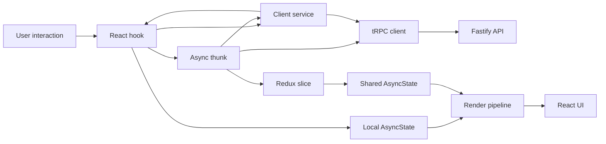

# Client State Architecture

This directory contains the shared client-state layer for Events System. It
sits between React interaction code and the tRPC client and provides consistent
patterns for:

- representing asynchronous state;
- coordinating network operations;
- updating shared application state;
- composing multi-request client workflows;
- rendering loading, empty, successful, and failed states.

The central idea is that async work should have an explicit owner and its state
should be impossible to misinterpret.

## Data Flow



A common shared-state workflow is:

```text
user interaction
  -> hook validates local input
  -> hook dispatches a thunk
  -> thunk calls tRPC or delegates to a client service
  -> thunk resolves or rejects
  -> slice extraReducers update AsyncState
  -> renderer selects the matching UI
```

Not every request belongs in Redux. Short-lived state used by a single feature,
such as search input and suggestions, can remain in its hook while still using
the same explicit async-state model.

## Directory Layout

```text
store/
├── root/          # Store creation and the Redux provider
├── slices/        # State ownership, reducers, and domain thunks
├── services/      # Reusable client-side query orchestration
├── reducers/      # Reducer composition
├── index.ts       # RootState, AppDispatch, and provider exports
└── README.md      # This document
```

## Responsibility Boundaries

| Concern | Primary owner |
| --- | --- |
| Form values and component-local interaction | React hooks |
| Debouncing and stale-request protection | React hooks |
| Shared application state | Redux slices |
| Async Redux lifecycle | `createAsyncThunk` and `extraReducers` |
| Mutations and their cross-slice UI effects | Async thunks |
| Multi-request reads and response compilation | Client services |
| Server communication | Typed tRPC client |
| Runtime boundary validation | Shared schemas |
| Async state-to-view decisions | Renderer pipelines |

These are guidelines rather than arbitrary folder rules. The deciding question
is which layer owns the behavior.

## `AsyncState<T>`

Shared asynchronous data is modeled as a discriminated union:

```ts
export type AsyncState<T, TEmptyMessage extends string = "No data found"> =
  | { status: "initial" }
  | { status: "pending" }
  | { status: "ready"; data: T }
  | { status: "n/a"; message: TEmptyMessage }
  | { status: "failed"; error: string };
```

Each state carries only the values that make sense for that state:

| Status | Meaning | Available value |
| --- | --- | --- |
| `initial` | Work has not started | None |
| `pending` | Work is in progress | None |
| `ready` | Data is available | `data` |
| `n/a` | Work succeeded but there is nothing to display | `message` |
| `failed` | The operation could not produce usable data | `error` |

This avoids combinations such as:

```ts
{
  isLoading: true,
  error: "Request failed",
  data: [...]
}
```

With independent flags and nullable values, contradictory states are possible
and every consumer must decide which field wins. `AsyncState<T>` makes the
state transition explicit and allows TypeScript to narrow the available fields.

### Empty is not failure

`n/a` is intentionally distinct from `failed`.

- An empty event history is a successful request with nothing to display.
- A rejected history request is a failure.

That distinction lets the client show useful empty-state copy without treating
ordinary absence of data as an error.

### Domain-specific variants

Some workflows extend the same idea with domain-specific states. For example,
opened-group event state can use `refreshing` when existing content should
remain conceptually separate from its background refresh.

Use the generic `AsyncState<T>` when its five states describe the lifecycle.
Introduce a domain-specific union only when the interface must render a
meaningfully different state.

## Rendering Async State

`AsyncStateRenderer` is the generic state-to-view boundary:

```tsx
<AsyncStateRenderer
  state={history}
  empty={() => <OpenedGroupFallback />}
>
  {(events) => <HistoryTimeline history={events} />}
</AsyncStateRenderer>
```

It provides default pending, empty, and failure UI while allowing a feature to
override each branch. Its exhaustive `switch` ends with `assertNever`, so adding
a new union member produces a compile-time reminder to update the renderer.

The renderer is intentionally separate from the slice:

- slices own state transitions;
- renderers decide what a state looks like;
- feature components provide ready-state content and optional fallbacks.

Other renderer pipelines use the same exhaustive-switch approach for
non-async unions, such as selected group views or role-specific drawer content.

## Redux Slices

Slices own durable, shared client state. The store currently contains state for:

- application bootstrap;
- authentication and viewer identity;
- events and the opened-event drawer;
- groups and the opened-group view;
- categories;
- notifications;
- user-account data;
- global rendering state such as drawers, sidebars, snackbars, and alerts.

Reducers should remain synchronous state transitions. Network requests and
multi-step workflows do not belong inside reducer functions.

### `extraReducers`

Slices use thunk lifecycle actions to map request outcomes into domain state:

```ts
builder.addCase(hydrateGroup.pending, (state) => {
  state.group = { status: "pending" };
});

builder.addCase(hydrateGroup.fulfilled, (state, action) => {
  state.group = { status: "ready", data: action.payload.group };
});

builder.addCase(hydrateGroup.rejected, (state) => {
  state.group = {
    status: "failed",
    error: "Unexpected error while hydrating the selected group",
  };
});
```

The thunk determines whether the operation succeeded. The slice determines how
that lifecycle changes its owned state.

## Async Thunks

Thunks coordinate async work that participates in Redux state or affects
multiple shared slices.

Examples include:

- authenticating a user;
- hydrating an opened group;
- scheduling an event;
- creating a group membership;
- updating an RSVP;
- creating a notification.

A thunk may:

1. signal pending rendering state;
2. call a tRPC mutation or client service;
3. dispatch related shared-state updates;
4. return a typed value to its caller;
5. log the original error and reject with that value.

For example, the RSVP thunk owns both the server mutation and the global
feedback/event-state consequences:

```text
updateRSVP
  -> pending snackbar
  -> eventAttendants.write.rsvp
  -> update viewer attendance status
  -> success or failure feedback
```

This keeps the corresponding hook focused on the selected value and form
submission.

### Returning and rejecting

Thunk payload creators should return useful successful results and use
`rejectWithValue` for handled failures:

```ts
try {
  const result = await trpcClient.example.mutate(input);
  return result;
} catch (error) {
  logCaughtError("ExampleSlice.operation()", error);
  return thunkAPI.rejectWithValue(error);
}
```

Callers choose whether rejection should affect their workflow:

```ts
const created = await dispatch(createSomething(input)).unwrap();
```

Use `.unwrap()` when later work requires the successful payload or when the
caller must enter its `catch` branch. Without `.unwrap()`, dispatch resolves to
the Redux action object even when the thunk action is rejected.

That difference is useful for secondary operations. For example, notification
creation can log its own failure without necessarily making an already
successful event creation appear to have failed.

## Client Services

Files in `services/` encapsulate reusable client-side orchestration that is more
substantial than a single request but does not itself own Redux state.

Current examples include:

- `AppSearchService`, which queries events and groups concurrently for focused
  suggestions and full search results;
- `EventFilterService`, which resolves filters into event layouts;
- `HydrateOpenGroupService`, which loads a group and its related metadata;
- `HydrateUserService`, which retrieves user dashboard data;
- `SyncDomainsService`, which initializes independent application domains with
  partial-failure handling;
- `SearchResultsCompiler`, which transforms server responses into suggestion
  shapes and relevance-ranked, unified event and group results.

Services commonly receive the typed tRPC client through their constructor:

```ts
const service = new AppSearchService(trpcClient);
```

This keeps transport dependencies visible and makes orchestration easier to
test or substitute.

### Services versus thunks

Use a **client service** when the main problem is:

- coordinating multiple reads;
- compiling or transforming several responses;
- applying a reusable query strategy;
- returning a result without directly owning Redux transitions.

Use a **thunk** when the main problem is:

- connecting an async operation to Redux lifecycle;
- performing a mutation;
- coordinating updates across slices;
- exposing a result through `dispatch`.

They can work together. `hydrateGroup`, for example, is a thunk because Redux
owns the opened-group lifecycle, but it delegates the multi-request hydration
work to `HydrateOpenGroupService`.

## Hooks

Hooks form the interaction boundary between React components and the client
state layer.

They are responsible for concerns such as:

- local form state;
- input normalization and schema validation;
- event handlers;
- memoized derived UI state;
- dispatching thunks;
- selecting shared state;
- ephemeral request coordination.

Hooks should not duplicate shared async workflows. When an operation changes
shared state or triggers global feedback, the hook dispatches the appropriate
thunk.

Some async behavior correctly remains local. Application search keeps the
controlled input and debounce timer in its hook, while Redux owns suggestion
and full-result lifecycles. Request IDs stored in the search slice prevent an
older response from overwriting newer suggestions or results.

## Application Search

Application search separates quick navigation from exploratory search so the
navigation autocomplete can remain focused without limiting the number or
context of results available elsewhere.

The navigation suggestion workflow is:

1. `useAppSearchSuggestions` owns the controlled input and debounces changes.
2. `querySuggestions` asks `AppSearchService` for limited event and group
   suggestions.
3. The search slice records the active suggestion request ID and ignores stale
   responses.
4. Selecting a suggestion opens the event or navigates directly to the group.

The full-search workflow is:

1. A free-text submission navigates to `/search?q=...` with an encoded query.
2. The search controller normalizes the query and dispatches `searchQuery`.
3. `AppSearchService` queries event and group search procedures concurrently.
4. `SearchResultsCompiler` merges and globally ranks the results by relevance.
5. The search slice stores the normalized `resultsQuery`, request ID, and
   explicit pending, ready, empty, or failed state.
6. The controller renders results only when `resultsQuery` matches the active
   route query, preventing results from a previous search from flashing while
   a newer request begins.

Search UI follows the same explicit lifecycle as the store. Network loading,
lazy result-card loading, ready results, empty results, and failures each have
distinct rendering behavior. Header copy is derived by a pure helper so all
states and singular/plural result counts remain exhaustively testable.

## Application Bootstrap

Startup hydration is treated as a coordinated domain sync:

1. `useInitializeDomains` starts `SyncDomainsService`.
2. The service requests independent initial datasets with
   `Promise.allSettled`.
3. Individual failures receive safe fallbacks.
4. A complete outage returns a rejected sync result.
5. `initializeDomains` distributes the result to bootstrap and domain slices.

This allows the application to remain usable when one noncritical initial
dataset fails while still providing a dedicated unavailable state when the
entire API cannot initialize.

## Error Handling

The client follows two separate error paths:

- **Operational detail** is preserved in logs through `logCaughtError`.
- **User-facing state** receives safe, domain-specific messages through
  `AsyncState`, alerts, snackbars, or fallbacks.

Avoid replacing a tRPC or network exception with a speculative client error
before logging it. The server is the authoritative source for authorization and
internal failures.

When an operation starts a global pending indicator, every completion path must
transition it to success, failure, or idle. Pending UI is state, not merely an
animation, and will otherwise remain active.

## Adding a Client Workflow

When adding async client behavior:

1. Decide whether the result is local or shared state.
2. Model shared async data with `AsyncState<T>` when its lifecycle fits.
3. Keep form and interaction details in a hook.
4. Use a service for reusable multi-request read orchestration.
5. Use a thunk for mutations and Redux lifecycle.
6. Preserve successful return values when callers need follow-up work.
7. Use `.unwrap()` only when rejection must propagate to the caller.
8. Handle pending, ready, empty, and failed outcomes explicitly.
9. Render unions exhaustively and end custom switches with `assertNever`.
10. Keep server authorization authoritative even when the client hides
    unavailable actions.

The goal is predictable ownership: a contributor should be able to identify
where an operation runs, where its state lives, and how that state becomes UI.
