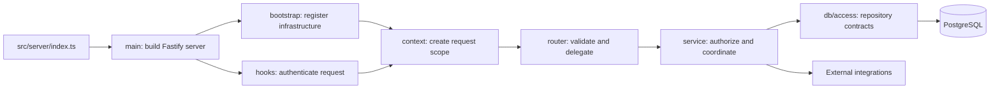

# Server Core

This directory contains the Fastify server's runtime architecture: server
construction, request handling, application behavior, persistence, and
server-only utilities. The executable entry point remains one level above at
[`src/server/index.ts`](../index.ts).

Use this document as a map of the server. For the design and conventions of the
application layer itself, see the
[`service` documentation](service/README.md).

## Architecture at a Glance



`buildServer()` is the composition root. It constructs the Fastify instance and
server-scoped `ApplicationAPI`, registers cookies and request authentication,
and mounts the tRPC API. For each request, tRPC creates a context containing the
request, reply, shared application API, and a request-scoped session handler.

## Directory Responsibilities

| Directory | Responsibility |
| --- | --- |
| `main/` | Constructs and configures the Fastify application. It does not start listening for connections. |
| `bootstrap/` | Loads environment values and registers infrastructure such as CORS and the tRPC Fastify plugin. |
| `hooks/` | Runs Fastify request lifecycle work. The current request hook resolves the session and assigns `req.user`. |
| `context/` | Defines tRPC primitives and creates the per-request context supplied to router procedures. |
| `router/` | Defines the public tRPC surface, validates transport input, and delegates application work. |
| `service/` | Enforces authorization and business rules, coordinates use cases, shapes results, and adapts external services. |
| `db/` | Owns the Kysely connection, repository implementations and contracts, database types, migrations, and development seeds. See the [`db/access` guide](db/access/README.md) for repository conventions. |
| `lib/` | Holds reusable server-only configuration, initialization, validation, errors, types, and focused utilities. |

## Request Lifecycle

1. [`src/server/index.ts`](../index.ts) calls `buildServer()` and starts the
   returned Fastify instance.
2. `buildServer()` creates the server-scoped `ApplicationAPI` and registers the
   server infrastructure.
3. The `onRequest` hook authenticates the session cookie and records the result
   on `req.user`.
4. The tRPC adapter creates a request context with `req`, `res`, the shared API,
   and a request-scoped `SessionHandler`.
5. A router procedure validates its input and delegates to a domain service or
   integration through `ctx.api`.
6. The service layer applies authorization and business rules before using the
   repository interfaces exposed by `DBClient`.
7. Repositories perform Kysely reads and writes against PostgreSQL, and the
   result returns through the service and router boundaries.

## Dependency Rules

- Keep router procedures limited to transport concerns: input validation,
  context access, and delegation.
- Put authorization, orchestration, business rules, and response shaping in the
  service layer.
- Depend on repository interfaces rather than concrete repository classes from
  application code. Narrow service dependencies to the capabilities they use
  when practical.
- Keep Kysely queries and persistence-specific behavior inside `db/access`.
- Keep request-specific state in the request context or request-scoped
  collaborators. Server-scoped services must remain safe to share across
  concurrent requests.
- Keep shared client/server contracts in `src/schemas`; `core/lib` is for
  server-only support code.
- Access third-party systems through service-layer integration adapters rather
  than directly from routers.

Dependencies should generally point inward along this path:

```text
router -> service -> repository interfaces -> repository implementations
```

Bootstrap and context assemble these layers but should not become homes for
business behavior.

## Where New Code Goes

| Change | Location |
| --- | --- |
| Add or change an API procedure | `router/routes/`, with shared schemas in `src/schemas` |
| Add a business use case | The appropriate domain service or focused handler under `service/` |
| Add an authorization rule | `service/auth/`, applied at the service or handler boundary |
| Add an external API dependency | An adapter under `service/integrations/`, exposed through the integration registry |
| Add a database operation | The relevant repository under `db/access/repositories/` |
| Add a repository domain | Its repository contract and implementation, then register it with `DBClient` |
| Change the database schema | A new ordered migration under `db/migrations/` and the corresponding database types |
| Add development fixture data | `db/seeds/data/` and `db/seeds/scripts/` |
| Add request-wide Fastify behavior | `hooks/` or `bootstrap/fastify/`, depending on lifecycle ownership |
| Add a server-only helper | The narrowest suitable location under `lib/`; keep domain rules in `service/` |

Tests should live beside their architectural concern. Service-layer behavior is
covered under `service/tests/`, while router-specific behavior can be tested
alongside the route.

## Related Documentation

- [`service/README.md`](service/README.md) describes service composition,
  domains, handlers, authorization, database boundaries, integrations, and
  testing strategy.
- [`db/migrations/`](db/migrations/) contains the ordered PostgreSQL schema
  history and migration runner.
- [`db/seeds/`](db/seeds/) contains local development seed data and scripts.
- [`db/access/README.md`](db/access/README.md) documents repository composition,
  persistence-boundary rules, transformations, and extension steps.
- The [repository README](../../../README.md) covers the full-stack architecture,
  local development, commands, testing, and deployment.
