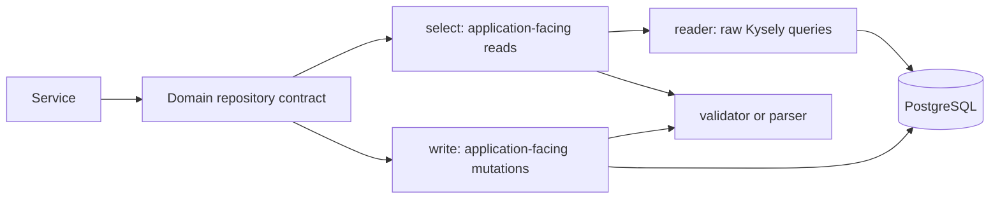

# Database Access Layer

This directory is the server's persistence boundary. It exposes typed repository
contracts to the service layer and keeps Kysely queries, database row shapes,
and persistence-specific transformations out of application behavior.

For the surrounding server architecture, see the
[`core` documentation](../../README.md). Database connection setup, migrations,
seeds, and generated database types live in the parent [`db`](../) directory.

## Structure

```text
access/
├── client/
│   └── dbClient.ts        # Repository facade and IDBClient contract
├── repositories/
│   ├── index.ts           # Concrete repository exports
│   └── <domain>/          # Domain repository and supporting components
└── types/
    └── types.ts           # Persistence-boundary result and helper types
```

`DBClient` constructs the concrete repositories from a Kysely `DB` instance and
exposes them through `IDBClient`. Services depend on `IDBClient`, or preferably
a `Pick<IDBClient, ...>` containing only the repositories they consume.

```text
service -> IDBClient -> repository contract -> Kysely -> PostgreSQL
```

## Repository Composition

Most domain repositories are facades composed from smaller collaborators:



The public shape commonly follows this pattern:

```ts
interface IDomainRepository {
  readonly select: IDomainSelector;
  readonly write: IDomainWriter;
}
```

This split is used by events, groups, group members, event attendants, and
notifications. It is a convention rather than a requirement for trivial
repositories: categories keeps a small flat interface, while authentication
uses a facade that coordinates private reader and writer collaborators.

## Component Roles

### Repository

The domain repository is the composition point and the contract exposed through
`IDBClient`. It constructs its reader, selector, writer, validator, or parser
once and exposes only the application-facing capabilities.

Concrete collaborators should not leak into service constructors. Add a method
to the repository's public interface when the application layer needs a new
persistence capability.

### Reader

A reader owns raw read queries and returns database-shaped Kysely results such
as `Selectable<Table>`. Reader methods are normally private to the repository
composition and are consumed by selectors rather than by services directly.

The `Raw*Reader` prefix makes this boundary explicit in several domains. A raw
reader may encode persistence concerns such as joins, filters, ordering, and
limits, but it should not own application authorization or business workflows.

### Selector

A selector is the public read surface. It calls the raw reader, handles
read-specific edge cases such as an empty ID collection, and converts or
validates database rows into shared schema types before returning them.

Selectors should not return raw rows merely because their current shapes happen
to match an API type. Keeping validation at this boundary prevents database
representation details—particularly `Date` values—from spreading upward.

### Writer

A writer owns inserts, updates, and deletes. It converts application input into
an insertable or updateable database shape and validates returned rows when
they cross back into the application layer.

A mutation involving multiple writes that must succeed or fail together belongs
in one Kysely transaction. Password reset demonstrates this rule by changing the
password, consuming the reset token, and removing existing sessions atomically.
Do not introduce a transaction for unrelated operations whose failure semantics
do not require atomicity.

### Validator

A validator maps database rows into shared schema representations and performs
runtime validation. This is where database-specific values such as `Date`
objects are converted to the serialized forms expected by the application.

Keep this separate when the mapping is reused by reads and writes or is large
enough to obscure query intent. Small repositories may keep focused validation
as private repository methods.

### Parser

A parser performs cohesive transformations that are broader than validation.
For example, the notifications parser converts raw rows to validated DTOs and
expands one application notification into insertable rows for multiple members.

Use a parser when both directions of a persistence transformation belong
together. A parser does not replace runtime schema validation for values leaving
the persistence boundary.

## Boundary Rules

- Keep SQL, Kysely expressions, table names, and raw database types in this
  layer.
- Expose repository capabilities through interfaces; application code should
  not depend on concrete repository classes.
- Return shared schema types, focused result types, or explicit absence from
  public repository methods. Avoid exposing raw rows beyond the boundary.
- Perform authorization and business orchestration in `service/`, not in
  repositories. Query constraints that protect the integrity of a requested
  write, such as matching both an event and group ID, still belong here.
- Validate and serialize returned database data before handing it to services.
- Use `executeTakeFirstOrThrow()` when absence means the persistence operation
  failed. Use `executeTakeFirst()` and an explicit optional return when absence
  is an expected result.
- Keep repository instances stateless. They are constructed once and shared by
  server-scoped services across requests.
- Put cross-domain application workflows in services rather than making one
  repository reach through another repository.

## Adding a Repository Capability

For a new operation in an existing domain:

1. Add the application-facing method to the selector or writer interface, or to
   the repository interface when the domain uses a flat facade.
2. Put a raw read query in the domain reader when a selector needs one.
3. Add the mapping and runtime validation required to return a shared schema
   type.
4. Implement the selector or writer method and expose it through the existing
   repository facade.
5. Add the capability to the narrow service database type that consumes it.
6. Test the service behavior and any meaningful persistence transformation or
   query edge cases.

For a new repository domain:

1. Create `repositories/<domain>/` and define its public repository contract.
2. Split reading, selection, writing, and transformation only where those roles
   add a useful boundary; a small flat repository is acceptable.
3. Export the concrete repository from `repositories/index.ts`.
4. Add the repository interface and readonly property to `IDBClient`.
5. Construct the repository in `DBClient` using the shared Kysely instance.
6. Inject only that new capability into the services that require it.

If the change requires a table or column change, add a new ordered migration
under [`../migrations`](../migrations/) and update the database types under
[`../types`](../types/). Do not modify an applied migration to represent a new
schema change.

## Current Repository Domains

| Property | Repository | Public shape |
| --- | --- | --- |
| `auth` | `AuthRepository` | Flat authentication and session facade |
| `categories` | `CategoriesRepository` | Flat read-only facade |
| `events` | `EventsRepository` | `select` and `write` |
| `groups` | `GroupsRepository` | `select` and `write` |
| `groupMembers` | `GroupMembersRepository` | `select` and `write` |
| `eventAttendants` | `EventAttendantsRepository` | `select` and `write` |
| `notifications` | `NotificationsRepository` | `select` and `write` |
