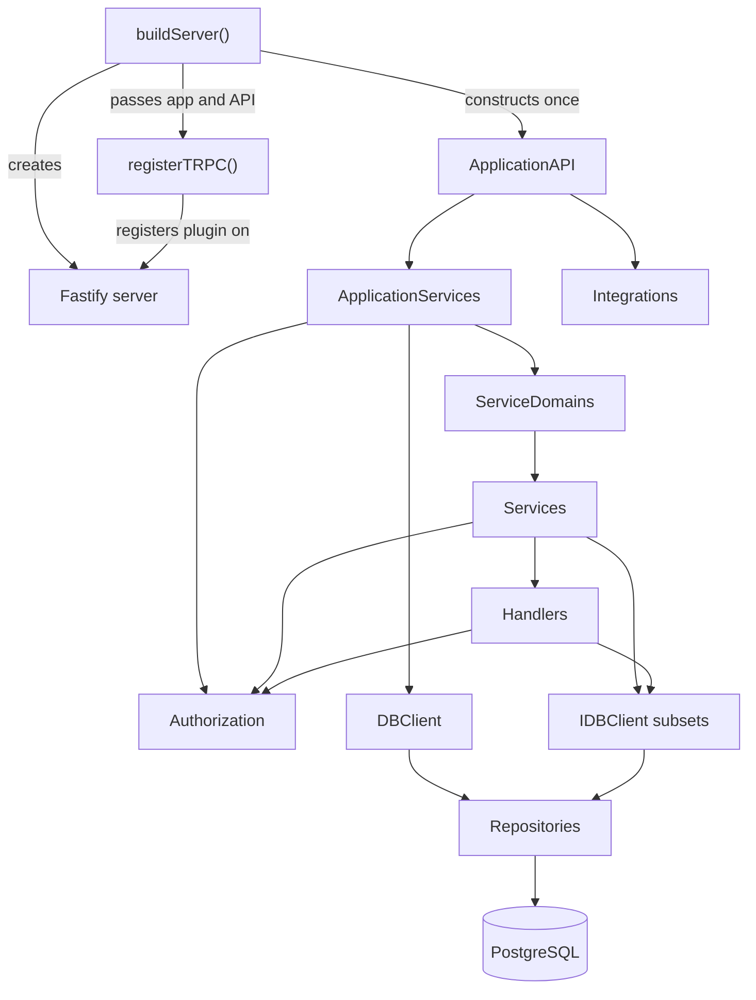
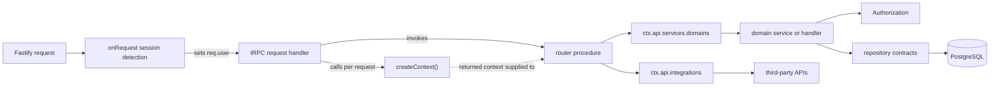

# Server Service Layer

This directory contains the application layer between the tRPC routers and the
database repositories.

Its job is to decide **what the application should do** for a request:
authorize the operation, coordinate collaborators, enforce business rules, and
shape the result. The database layer remains responsible for **how data is read
and persisted**.

## Design Goals

- Keep tRPC routers thin.
- Keep authorization explicit and server-enforced.
- Give business rules a clear, testable home.
- Separate orchestration from persistence.
- Expose stable interfaces between architectural layers.
- Give each service only the database capabilities it consumes.

## Server Composition and Dependencies



This diagram describes startup ownership and dependency construction. It is not
the per-request execution sequence.

## Request Control Flow



The Fastify request hook authenticates the session before tRPC creates the
request context. The tRPC handler then invokes the selected procedure with that
context. Application behavior flows through `ctx.api.services.domains`, while
external operations use the parallel `ctx.api.integrations` branch.

## Composition Root

`buildServer()` is the application composition root. It creates one
`ApplicationAPI` for the lifetime of the Fastify server and injects it into
`registerTRPC()`. The service graph is assembled beneath that API in three
layers, with integrations exposed as a parallel branch.

Each request context reuses the server-scoped API while constructing only its
request-scoped dependencies: the Fastify request, reply, and `SessionHandler`.
This keeps application services stateless and avoids rebuilding repositories,
handlers, integrations, and SDK clients for every request.

### `applicationApi.ts`

`ApplicationAPI` is constructed once by `buildServer()`, passed through tRPC
registration, and attached to each request context as `ctx.api`. It exposes:

- `services`, application-owned behavior grouped by domain
- `integrations`, adapters for external services

### `applicationServices.ts`

`ApplicationServices` creates the shared application dependencies:

1. `DBClient`
2. `RoleBasedAccessHandler`
3. `Authorization`
4. `ServiceDomains`

This assembles the database-backed portion of the application graph.

### `domains/serviceDomains.ts`

`ServiceDomains` constructs and exposes the domain entry points:

- `session`
- `users`
- `groups`
- `events`
- `participations`
- `notifications`

Routers access them through `ctx.api.services.domains`.

### Dependency Lifetimes

| Scope | Dependencies | Lifetime rule |
| --- | --- | --- |
| Server | `ApplicationAPI`, application services, domain services, repositories, and integrations | Constructed once by `buildServer()` and shared by requests handled by that server instance |
| Request | Fastify `req`, `res`, and `SessionHandler` | Constructed for each request because these dependencies contain request-specific state |

Server-scoped services must remain stateless and safe to use across concurrent
requests. Request-specific data should be passed into service methods or kept in
request-scoped collaborators rather than stored on shared service instances.

## Directory Layout

```text
service/
├── auth/            # Authentication and role-based policy guards
├── domains/         # ServiceDomains registry and its contract
├── handlers/        # Focused application workflows and transformations
├── integrations/    # External-service adapters and contracts
├── services/        # Domain entry points and service contracts
├── tests/           # Unit tests organized by responsibility
├── applicationApi.ts      # Context-facing API facade
├── applicationServices.ts # Database-backed application composition
├── integrations.ts        # Integration registry exposed by ApplicationAPI
└── types.ts         # Shared service-layer types
```

## Domain Services

Services are the stable entry points for application use cases. Some coordinate
work directly; others expose smaller handler facets.

| Domain | Public surface | Responsibility |
| --- | --- | --- |
| Events | `query`, `lifecycle`, `timeline`, `layout`, `hydrate` | Event reads, mutations, history, layout, and drawer hydration |
| Groups | `query`, `groupLifecycle`, `memberships` | Group discovery, creation, membership, and group metadata |
| Participations | `rsvps`, `census` | RSVP state, attendance shaping, counts, and popularity |
| Session | Direct service methods | Login, logout, recovery, and password reset |
| Users | Direct service methods | Account lookup, memberships, and created groups |
| Notifications | Direct service methods | Notification creation, retrieval, and seen state |

The interfaces in `services/types.ts` define these public surfaces so routers
and domain composition depend on contracts rather than concrete classes.

## Handlers

Handlers contain application logic that is narrower than an entire domain
service.

### Handler Method Boundaries

Public handler and service methods define the application-facing operation.
They keep entry concerns visible, including authentication, authorization, and
input validation. Callers can therefore understand the operation's contract
without reading its implementation details.

When an operation requires more than a single database call, or includes
meaningful orchestration, branching, error translation, or data shaping, the
public method delegates that work to a descriptively named private method. The
private method owns the workflow and receives values that have already passed
the public entry checks.

```ts
async createEvent(input, groupId, userId) {
  const authenticatedId = this.policy.requireAuthenticated(userId);
  await this.policy.requireOrganizer(authenticatedId, groupId);

  return await this.persistNewEvent(input);
}
```

This boundary keeps security requirements prominent while allowing the
underlying workflow to evolve without making the public API describe each
repository interaction.

A public method that only forwards one database call does not need a private
wrapper:

```ts
async getEventById(eventId) {
  return await this.db.events.select.byId(eventId);
}
```

The goal is to hide substantial implementation work, not to require delegation
for its own sake. Mapper and composer classes may further encapsulate cohesive,
reusable transformations that support a handler's private workflow.

### Events

- `EventQueryHandler` performs event reads and search.
- `EventLifecycleHandler` creates events and changes scheduling status.
- `EventTimelineHandler` builds past, archived, and next-event views.
- `EventLayoutHandler` loads event sets for client layout use cases.
- `EventLayoutComposer` paginates events and produces validated layout slots.
- `EventHydrationHandler` assembles event, group, role, RSVP, and count metadata
  for the opened-event drawer.

### Groups

- `GroupQueryHandler` performs group, category, member, organizer, and slug
  lookups.
- `GroupLifecycleHandler` creates a group and assigns its organizer membership.
- `MembershipHandler` joins users to groups, removes memberships, and resolves
  roles and head counts.

### Participations

- `RsvpHandler` updates attendance, retrieves viewer RSVP data, creates the
  attendance dictionary, and assembles user RSVP history.
- `ParticipationDtoHandler` converts event, group, and attendance data into the
  client-facing RSVP shape.
- `CensusHandler` calculates attendance counts and derives popular groups and
  events.

### Session

- `SessionHandler` is request-scoped and owns writing and clearing the signed
  session cookie on the Fastify request and reply.

## Authorization

Client-side role-based rendering improves the interface, but it is not treated
as a security boundary. Mutating and viewer-specific operations are authorized
again in this layer.

`Authorization` exposes application-facing guards:

- `requireAuthenticated`
- `requireToken`
- `requireOrganizer`
- `requireIsGroupMember`
- `requireCanChangeMembership`

### Authenticated User IDs

`requireAuthenticated()` performs the runtime authentication check and returns
an `AuthenticatedUserId`. This branded string records, in the type system, that
the application has already established the authentication invariant.

```text
string | null | undefined
        ↓ requireAuthenticated()
AuthenticatedUserId
        ↓
authenticated private workflow
```

Public service and handler methods accept raw request IDs and call
`requireAuthenticated()` at the application boundary. Private workflows that
require an authenticated actor accept `AuthenticatedUserId` rather than a
plain `string`:

```ts
async getMemberships(userId: string | null | undefined) {
  const actor = this.policy.requireAuthenticated(userId);
  return await this.membershipsOfUser(actor);
}

private async membershipsOfUser(actor: AuthenticatedUserId) {
  return await this.db.groupMembers.select.byUserId(actor);
}
```

The brand prevents accidental use of an unchecked ID inside authenticated
workflows. It does not replace runtime authorization: TypeScript types are not
present when the server executes. The cast that creates an
`AuthenticatedUserId` remains centralized inside `Authorization`, immediately
after the runtime check; application code should obtain the type through
`requireAuthenticated()` rather than casting IDs directly.

`RoleBasedAccessHandler` resolves the user's group role through the
`groupMembers` repository and evaluates it against the centralized permissions
configuration.

The separation is intentional:

- `Authorization` expresses the business rule and produces the appropriate
  resolver error.
- `RoleBasedAccessHandler` answers whether a role permits an action.
- Repositories only retrieve the persistence data needed to make that decision.

## Database Boundaries

`DBClient` implements `IDBClient`, whose properties are repository interfaces
rather than concrete repository classes.

```ts
export interface IDBClient {
  readonly events: IEventsRepository;
  readonly groups: IGroupsRepository;
  readonly auth: IAuthRepository;
  readonly categories: ICategoriesRepository;
  readonly groupMembers: IGroupMembersRepository;
  readonly eventAttendants: IEventAttendantsRepository;
  readonly notifications: INotificationsRepository;
}
```

Service constructors narrow that interface with `Pick`:

```ts
export type SessionServiceDb = Pick<IDBClient, "auth">;

export type NotificationServiceDB = Pick<
  IDBClient,
  "notifications" | "groupMembers"
>;
```

This makes dependencies visible in the type system. A service cannot
accidentally reach into an unrelated repository, and tests can provide smaller
structural mocks.

Current service-level database requirements are:

| Service | Repository capabilities |
| --- | --- |
| `SessionService` | `auth` |
| `UserService` | `auth`, `groups`, `groupMembers` |
| `ParticipationsService` | `events`, `groups`, `groupMembers`, `eventAttendants` |
| `EventService` | `events`, `groups`, `groupMembers`, `eventAttendants` |
| `NotificationService` | `notifications`, `groupMembers` |
| `PasswordResetEmailService` | `auth` |
| `RoleBasedAccessHandler` | `groupMembers` |

`GroupService` currently receives the full client because its query, lifecycle,
and membership facets collectively use most of the group-related repositories.

## Integrations

External services are exposed separately from the database-backed domains:

- `GeoApifySearch` provides city and street address suggestions through
  `ctx.api.integrations.geoApify`.
- `ResendPasswordResetMailer` sends password-reset email behind
  `PasswordResetEmailService`.

Keeping integrations behind adapters prevents external SDK and transport
details from spreading through routers and domain services.

## Example Workflows

### Creating an event

`eventRouter` delegates to
`domains.events.lifecycle.createEvent(newEvent, groupId, userId)`.

The handler:

1. requires an authenticated user;
2. verifies organizer permission for the group;
3. writes through `db.events.write.create(...)`;
4. returns a client-facing success or failure result.

### Loading a user's RSVPs

The router delegates to `domains.participations.rsvps.getRsvpdEvents(userId)`.

The handler:

1. requires authentication;
2. retrieves the user's attendance records;
3. removes records that are not meaningful active RSVPs;
4. returns early when no qualifying records remain;
5. loads the corresponding events and group names;
6. delegates response shaping to `ParticipationDtoHandler`;
7. validates the resulting RSVP collection.

### Creating a group

The router delegates to
`domains.groups.groupLifecycle.createNewGroup(userId, input)`.

The handler:

1. requires authentication;
2. creates the group through `groups.write.createGroup(...)`;
3. assigns the creator as organizer through
   `groupMembers.write.addOrganizer(...)`;
4. returns the created group.

## Business Rules

Important rules enforced in this layer include:

- RSVP mutations and viewer-specific participation data require authentication.
- Organizer permission is required to create or change events.
- Organizer permission is required to publish group notifications.
- Reading group notifications requires group membership.
- Membership changes are checked against role-aware permissions.
- New groups receive an organizer membership for their creator.
- RSVP and membership data is shaped before crossing the API boundary.
- Empty datasets short-circuit before unnecessary dependent reads.
- Opened-event hydration combines public event data with viewer-specific state.

## Testing Strategy

Tests are organized under:

- `tests/auth`
- `tests/handlers`
- `tests/services`

They prioritize behavior with the highest regression risk:

- authentication and authorization branches;
- allowed and denied role-based operations;
- orchestration across repositories and collaborators;
- data transformation and response shaping;
- early-return behavior and empty collections;
- event lifecycle, history, layout, and hydration;
- group creation and membership changes;
- RSVP, attendance, notification, session, and password-reset behavior.

The database dependencies are mocked at their interfaces, so these tests protect
application rules without requiring a live PostgreSQL instance.

Run them from the repository root:

```bash
pnpm test -- --runInBand
```

## Adding a Use Case

When adding server behavior:

1. Add or update the shared input and output schemas.
2. Keep the tRPC route limited to validation, context access, and delegation.
3. Place the use case in the appropriate service or focused handler.
4. Apply authorization before protected reads or writes.
5. Add only the repository capabilities the use case needs.
6. Keep SQL and Kysely details inside the database layer.
7. Validate shaped data before returning it across the API boundary.
8. Add tests for success, authorization failure, and meaningful edge cases.

This structure is meant to make the next change easier to locate, reason about,
and verify—not to add abstraction for its own sake.
